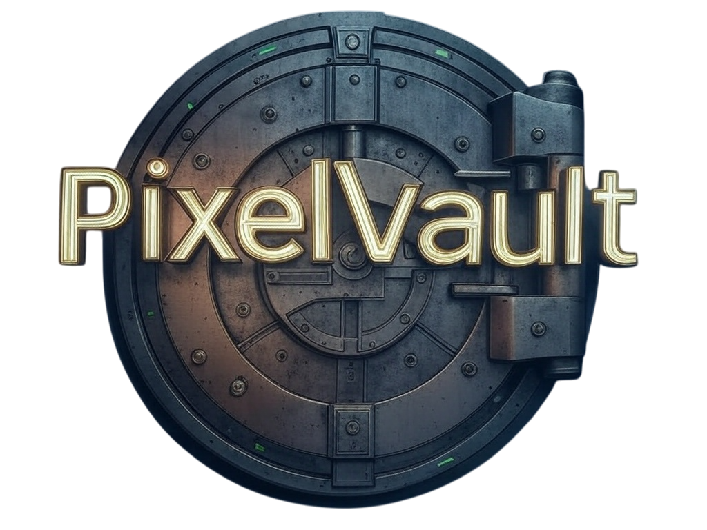

# PixelVault - E-commerce de Videojuegos

 

## 📜Descripción del Proyecto
PixelVault es un e-commerce especializado en videojuegos para múltiples plataformas (Xbox, Nintendo, PC, etc.). El proyecto permite a los usuarios explorar productos, gestionar listas de deseos, realizar compras con pasarelas de pago como PayPal y Stripe, y administrar su perfil. Además, incluye un panel de administración para gestionar productos, usuarios y pedidos.

## 🖥️ Tecnologías Utilizadas
- **Backend**: 
  - Lenguaje: C# 
  - Framework: .NET 8
  - Base de datos: SQL Server
- **Frontend**: 
  - Framework: Vue 3 con TypeScript
  - Estilos: Tailwind CSS 
- **Otros**:
  - Autenticación: JWT
  - Pasarelas de pago: PayPal y Stripe
  - Envío de emails: SendGrid o similar (para confirmación de registro)

## 🔗 Estructura del Proyecto
### 📌 Mapa de Navegación 
- **Páginas principales**:
  - **Home**: Catálogo destacado.
  - **Play/Xbox/Nintendo/PC**: Filtrado por plataforma.
  - **Products**: Listado completo con paginación.
  - **Cart**: Carrito de compras con checkout.
  - **About Us**: Información de la empresa.
  - **Sign Up/Login**: Gestión de usuarios.
- **Panel de Administración**:
  - **Users**: CRUD de usuarios.
  - **Products**: Gestión de productos (crear, editar, stock).
  - **Brands**: Administración de marcas.
  - **Orders**: Visualización de pedidos.

## 📋Requisitos Cumplidos
- ✅ **Frontend**: 
  - Paginación actualizada por URL.
  - Favicon y título semántico.
  - Listas de deseos y favoritos.
- ✅ **Backend**: 
  - API RESTful con .NET 8.
  - Migraciones para la base de datos.
- ✅ **Extra**: 
  - Manuales de usuario y administrador.
  - Diagramas (flujo, casos de uso, clases) explicados en la memoria.

 ##  📂 Project Structure

## PixelVault/
```
├── Client/                # Vue 3 Frontend
│   ├── src/
│   │   ├── assets/         # Styles, images
│   │   ├── components/     # Reusable UI
│   │   └── views/          # Page components
├── Server/                 # .NET Backend
│   ├── Controllers/
│   ├── Models/
│   └── Migrations/
├── docs/                   # Project documentation
├── resources/images        # Images          
└── README.md               # This file
```
### ⚙️ Installation
```bash
# Clone repository
git clone https://github.com/aadrii09/PixelVault.git
cd PixelVault

# Backend
cd Server
dotnet restore
dotnet ef database update
dotnet run

# Frontend
cd ../Client
npm install
npm run dev
```
